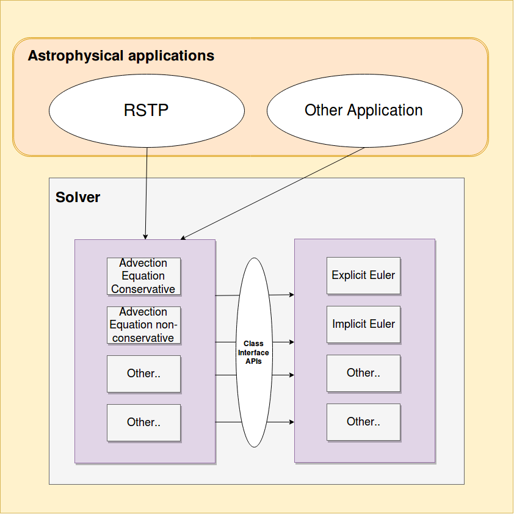

# AstroFV
AstroFV is a Finite Volume Solver for Astrophysical applications written in Python

## Current Features
* Solver
  * 1-D solver
  * Time integration using Explicit Euler and Implicit Euler techniques 
  * Finite Volume Method with first-order upwind discretization
  * Structured mesh
* Equations
  * (Nonlinear) Advection Equation in conservative form with space dependent velocity
* Available Astrophysical applications
  * 1-D RSTP (Relativistic Shock Tube Problem)
* General characteristics
  * Aimed at simple to use for user and easily extensible for developer
  * Object oriented, well modular design
  * no GPU support

## High level view

The AstoFV is divided into two modules:
*  Solver: This is further divided into two submodules:
   * One submodule defines the set of equations which are supported by the solver
   * Another submodule implements the actual numerical techniques
   
   Abstract interfaces are used to allow equations to use any numerical methods in a generic manner

*  Astrophysical applications: This implements the respective application whose solution is needed by solving a system of equations
   
   Abstract interfaces are used to allow applications to easily define and use the Solver equations

## Example usage
### Code to solve RSTP with Explicit Euler technique
    eparams = RSTPExplicitParams(1000,4/3,0.25) 
    eparams.set_fig_path('./figs/')
    eparams.fv_boundary_strategy = FVTransverse #Default 
    eiv = RSTPIV(Vx=[0,0],Mx=[0,0],D=[1,10**-2],Rho=[1,10**-2])
    ebv = RSTPBV()
    test_explicit = RSTPTest(1,eparams,eiv,ebv,ode_strategy=ODEExplicit)
    test_explicit.solve()
    
### Code to solve RSTP with Implicit Euler technique
    iparams = RSTPImplicitParams(1000,1.0,4/3,2,0.7)
    iparams.set_fig_path('./figs/')
    iparams.fv_boundary_strategy = FVTransverse #Default 
    iiv = RSTPIV(Vx=[0,0],Mx=[0,0],D=[1,10**-2],Rho=[1,10**-2])
    ibv = RSTPBV()
    test_implicit = RSTPTest(2,iparams,iiv,ibv,ode_strategy=ODEImplicit)
    test_implicit.solve()
    

See more at [User manual](afv_user_manual.md) and [Developer manual](afv_developer_manual.md)
